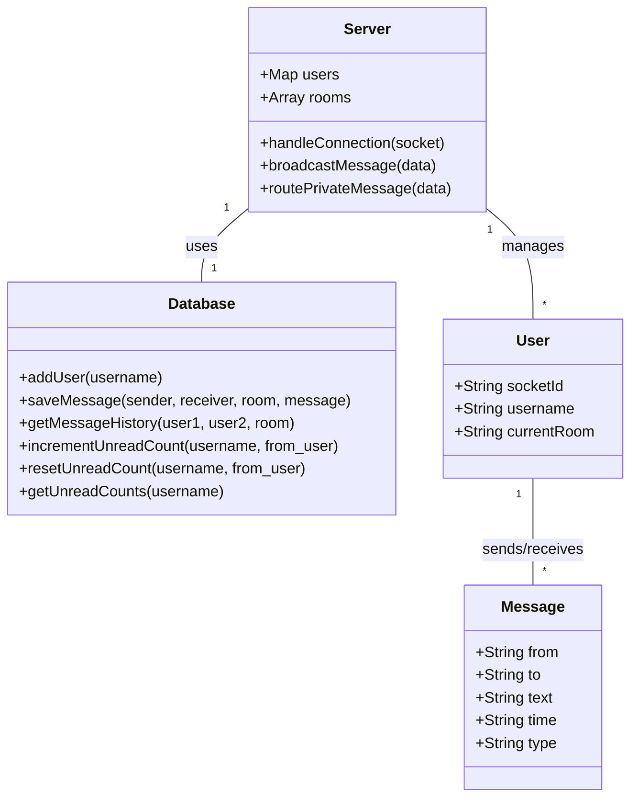
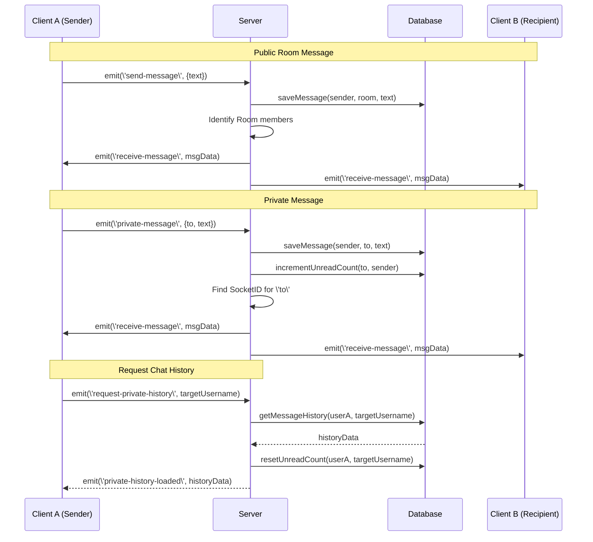

# UML Diagrams for Real-Time Chat System

This document provides the visual architecture of the system using UML diagrams, updated to reflect the integration of the SQLite database.

---

## 1. Use Case Diagram
The Use Case diagram describes the functional requirements of the system from the perspective of the user, including interactions with the database.

```mermaid
useCaseDiagram
    actor User
    actor Server
    actor Database

    User --> (Join Chat System)
    User --> (Switch Chat Rooms)
    User --> (Send Public Message)
    User --> (Send Private Message)
    User --> (View Online Users)
    User --> (View Chat History)
    
    (Join Chat System) ..> Server : Register Socket
    (Send Public Message) ..> Server : Broadcast to Room
    (Send Private Message) ..> Server : Route to Specific ID
    (View Chat History) ..> Server : Request History
    
    Server --> Database : Save/Retrieve Messages
    Server --> Database : Manage Users
```

**Explanation:** The User interacts with the system to join, message, and manage their presence. The Server acts as the backend facilitator for all these actions, now persistently storing and retrieving data from the Database.

---

## 2. Class Diagram
The Class Diagram shows the structure of the system and the relationships between different objects, including the new Database class.



**Explanation:** The `Server` class is the central manager that holds a collection of `User` objects and now interacts directly with the `Database` class for persistent storage. Each `User` can be associated with multiple `Message` objects.

---

## 3. Sequence Diagram
The Sequence Diagram illustrates how objects interact over time during a message exchange, showing the involvement of the database.



**Explanation:** This diagram shows the flow of data for both public and private messages, highlighting the server's role as a router and its interaction with the database for message persistence and unread count management.

---

## 4. Component Diagram
The Component Diagram shows the high-level organization of the software components, now explicitly including the SQLite Database.

```mermaid
componentDiagram
    [Web Browser] <<Client>> as Client
    [Node.js Runtime] <<Server>> as Server
    [SQLite Database] <<Database>> as DB
    
    component "Frontend Assets" {
        [HTML5/CSS3]
        [Socket.io Client]
    }
    
    component "Backend Logic" {
        [Express.js]
        [Socket.io Engine]
        [Database Module]
    }

    Client -- Server : WebSocket (WS)
    Client -- Server : HTTP (Static Files)
    Server -- DB : SQL Queries
```

**Explanation:** The system is divided into the Frontend (Assets and Client Library) and the Backend (Express, Socket.io, and the data store), connected via HTTP and WebSockets. The Backend now explicitly interacts with the SQLite Database for persistent data storage.
